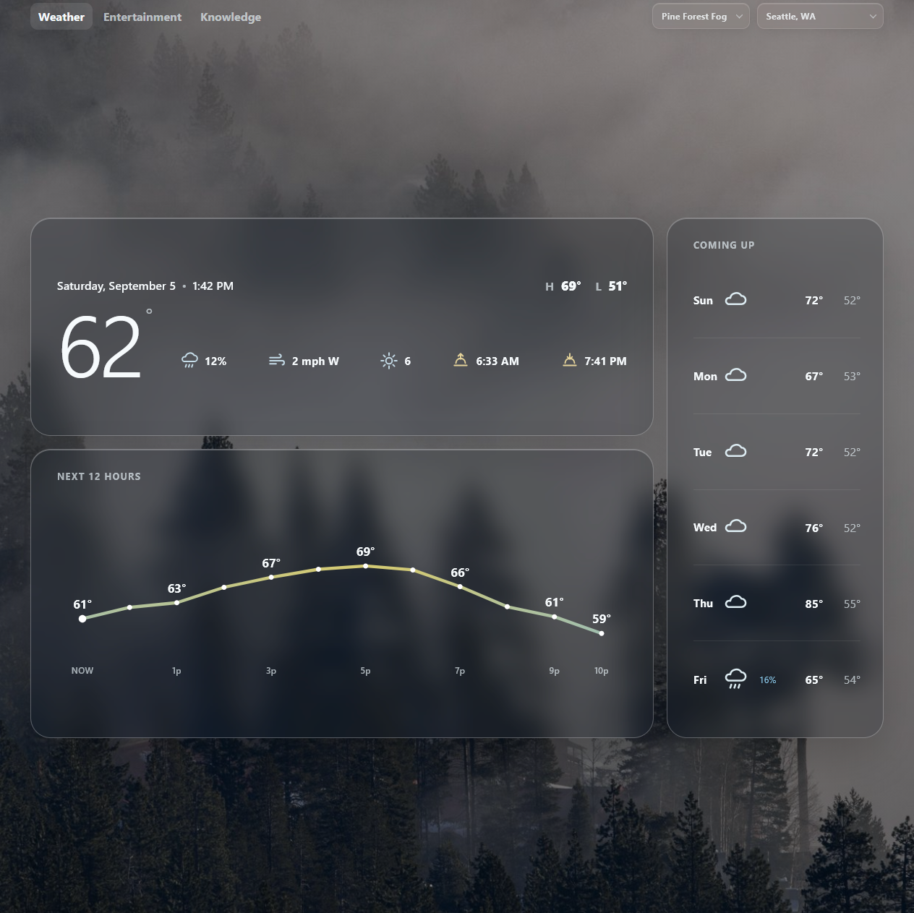

# At a Glance

A serverless daily dashboard for weather, local events, entertainment, and knowledge, built with React, TypeScript, Python, and AWS.

[View Live App](https://d6ul0xqk7ua47.cloudfront.net/)

## About

At a Glance is a serverless dashboard designed to surface useful daily information in one place, tailored to where you live. It combines weather forecasts, nearby concert events, upcoming movies and music releases, historical events, trivia, and vocabulary across a responsive interface built for desktop, tablet, and mobile.

Rather than using a traditional always-running backend, the application uses EventBridge Scheduler to trigger AWS Lambda functions that periodically fetch and normalize data. Precomputed JSON and static assets are stored in Amazon S3 and delivered through Amazon CloudFront.
