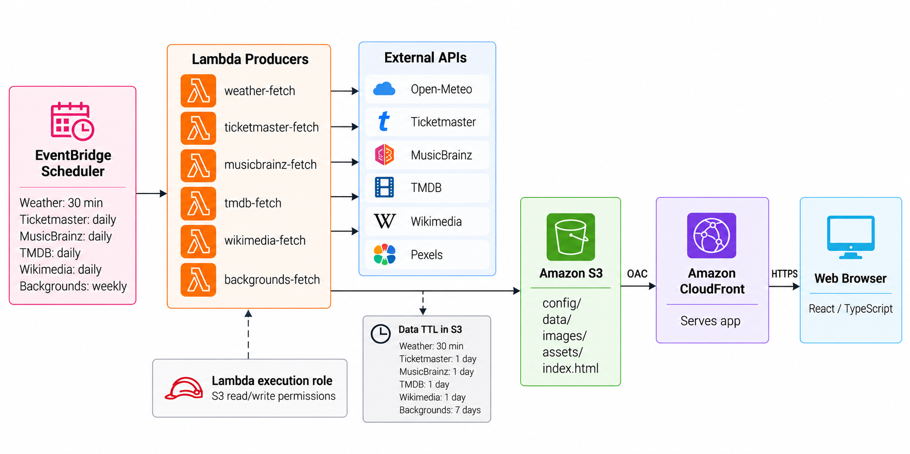

# At a Glance

A serverless daily dashboard for weather, local events, entertainment, and knowledge, built with React, TypeScript, Python, and AWS.

[View Live App](https://d6ul0xqk7ua47.cloudfront.net/)

## About

At a Glance is a serverless dashboard designed to surface useful daily information in one place, tailored to where you live. It combines weather forecasts, nearby concert events, upcoming movies and music releases, historical events, trivia, and vocabulary across a responsive interface built for desktop, tablet, and mobile.

Rather than using a traditional always-running backend, the application uses EventBridge Scheduler to trigger AWS Lambda functions that periodically fetch and normalize data. Precomputed JSON and static assets are stored in Amazon S3 and delivered through Amazon CloudFront.

## AWS Architecture

## Engineering Decisions & Tradeoffs

### Simplifying the Architecture
At a Glance originally ran on EC2 and later Lightsail with FastAPI, SQLAlchemy, and PostgreSQL. Because the workload is primarily read-only and changes on predictable intervals, I replaced the always-running backend with scheduled Lambda functions and precomputed JSON in S3. This trades real-time processing for significantly lower cost, complexity, and operational overhead.

### Freshness vs. Reliability
Each data source is refreshed according to how quickly it changes, with corresponding CloudFront cache policies. If an upstream API fails, the system generally preserves the last successful snapshot rather than overwriting it with incomplete data. This intentionally favors temporary staleness over an unavailable or broken dashboard.

### Failure Isolation
Each external API is handled by an independent Lambda producer with its own schedule and failure boundary. One integration can fail without preventing unrelated data from updating. This adds some infrastructure configuration but keeps integrations independently testable, observable, and easier to maintain.

### Predictable API Usage
External APIs are called on scheduled cadences rather than in response to page views. This keeps API consumption predictable and within free-tier limits while allowing frequently changing sources such as weather to update more often than slower-changing content.

### Cost as a Design Constraint
The architecture was designed for near-zero ongoing cost without requiring an always-running server. S3 stores the static application and generated data, CloudFront handles cached delivery, and Lambda performs computation only when scheduled. The result sacrifices some runtime flexibility in exchange for predictable cost and minimal infrastructure to operate.
